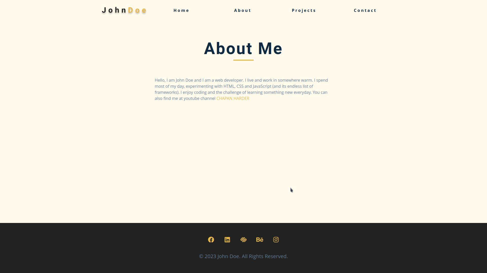

# Setup 

1. Download fontawesome from [here](https://use.fontawesome.com/releases/v6.4.2/fontawesome-free-6.4.2-web.zip).
2. Decompress the file and rename it to `fontawesome`
3. Host it...

## Demo

